# (C# 코딩) 파일 비교툴 (File Compare)

## 개요
- C# 프로그래밍 학습
	- 1줄 소개: 폴더 2개를 비교하고 파일 이름과 크기를 비교하여 결과를 보여주는 윈도우 폼 애플리케이션

- 사용한 플랫폼: 
	- C#, .NET Windows Forms, Visual Studio, GitHub

- 사용한 컨트롤:
	- Label, TextBox, ListView, Button

- 사용한 기술과 구현한 기능:
	- Visual Studio를 이용하여 UI 디자인
	- SplitContainer 컨트롤을 이용하여 폴더 선택과 결과 표시 영역 분리
	- listView 컨트롤을 이용하여 파일 이름과 크기 비교 결과 표시

## 실행 화면 (과제1)
- 코드의 실행 스크린샷과 구현 내용 설명
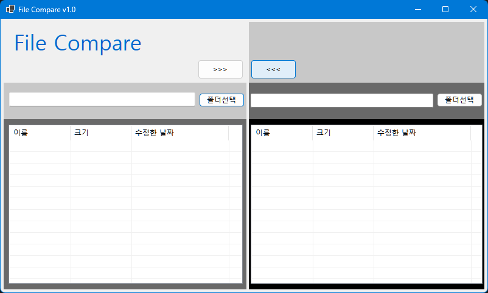
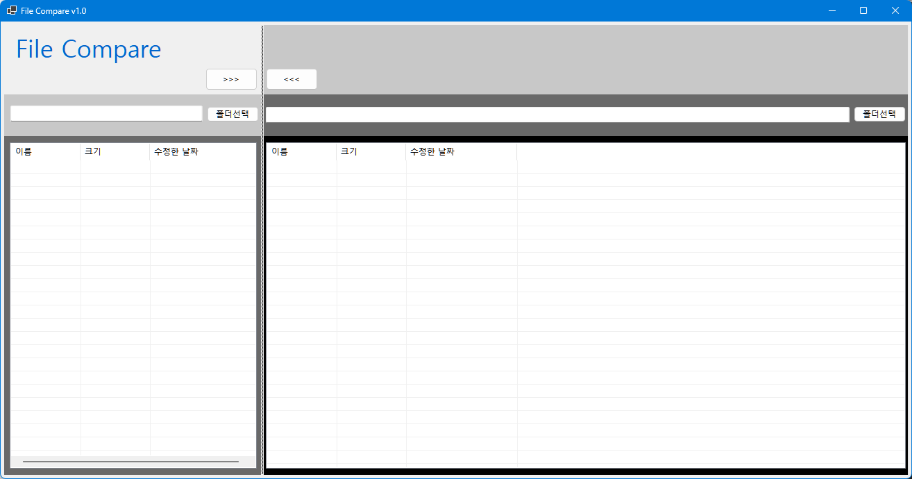
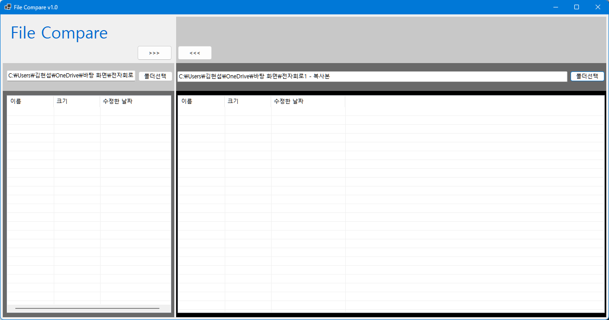
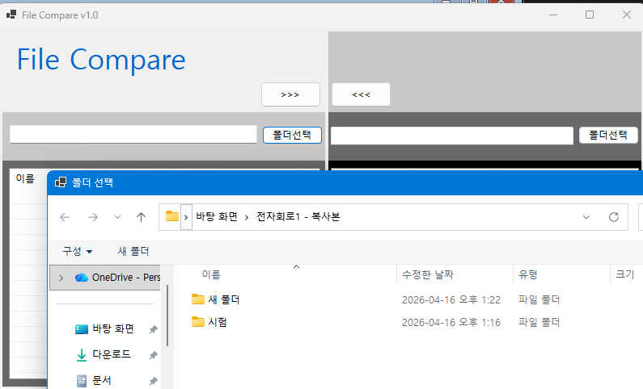
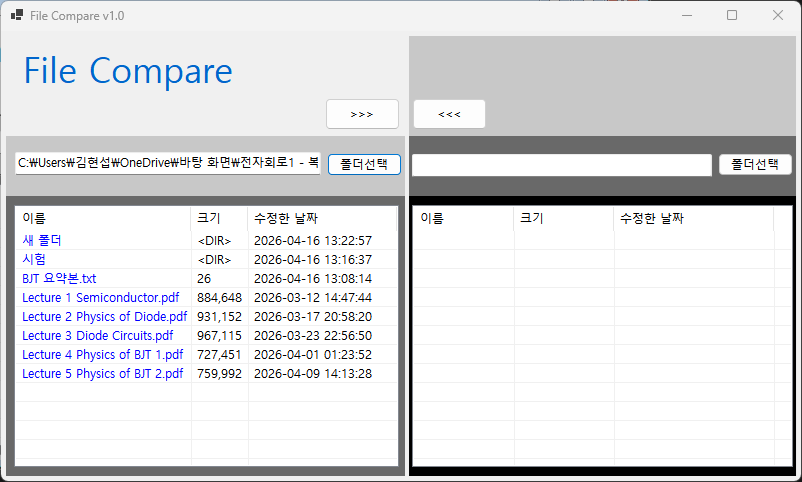
- 구현한 내용 (위 그림 참조)
	- UI 구성 : Label(앱 이름 표시), TextBox(폴더 경로 입력), Button(폴더 선택), ListView(비교 결과 표시)
	- 사용자에게 폴더 경로를 입력받아 폴더 선택 다이얼로그를 통해 폴더를 선택할 수 있도록 구현

## 실행 화면 (과제2)
- 코드의 실행 스크린샷과 구현 내용 설명
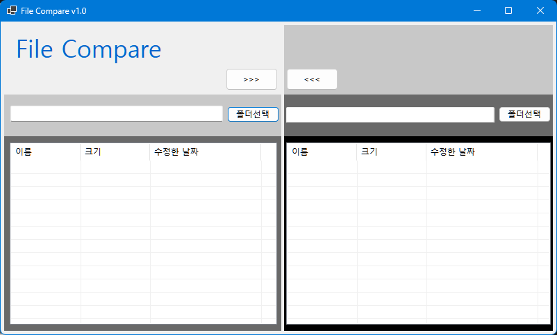
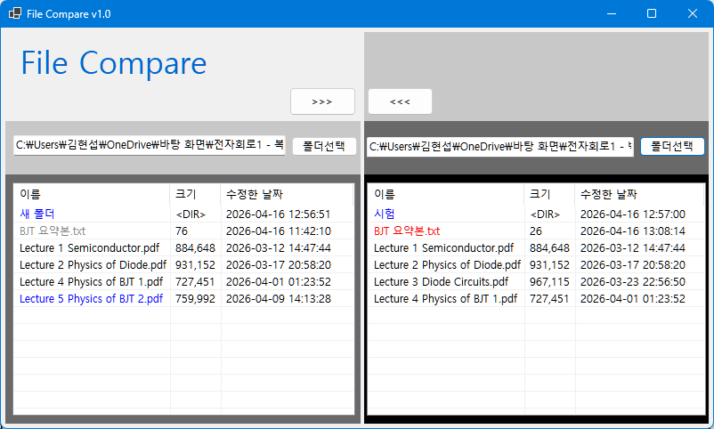
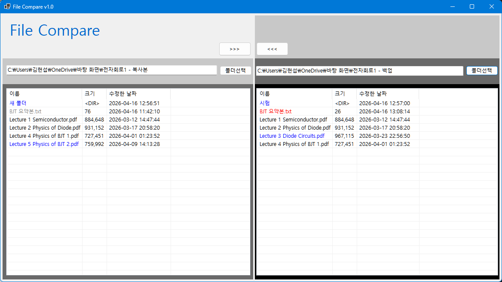
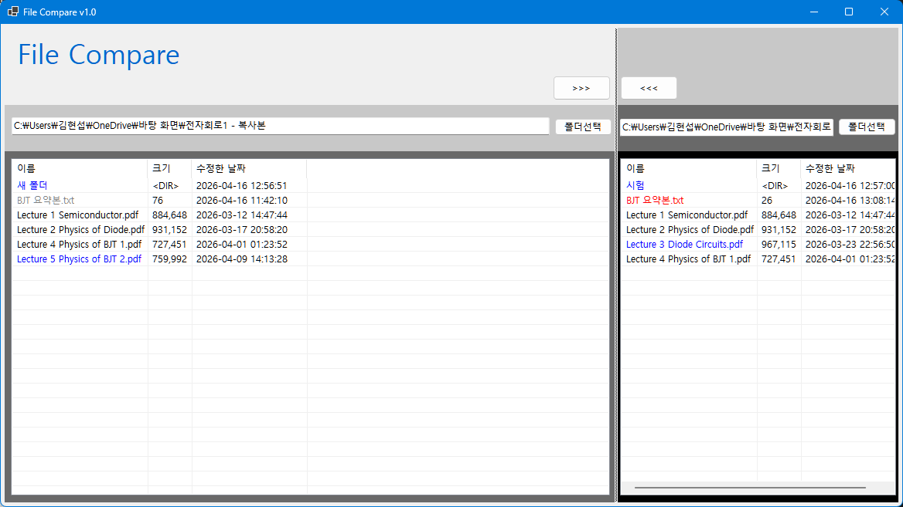
- 구현한 내용 (위 그림 참조)
	- 선택한 폴더의 파일 목록을 가져와 ListView에 표시
	- 파일 이름과 크기를 비교하여 결과를 ListView에 표시 (예: 동일한 파일, 다른 파일, 폴더에만 존재하는 파일 등)
	- 파일 이름, 크기, 수정한 날짜가 동일하면 검정색으로 표사 
	- 동일하지만 버전이 다른 파일은 신버전을 빨간색, 구버전을 회색으로 표시 
	- 폴더에만 존재하는 파일은 파란색으로 표시

## 실행 화면 (과제3)
- 코드의 실행 스크린샷과 구현 내용 설명
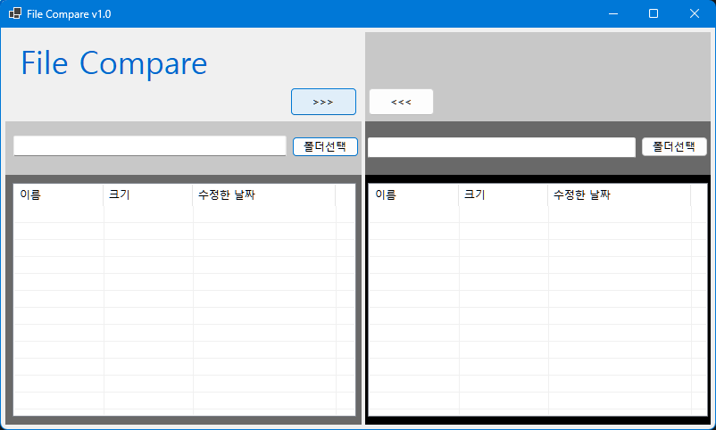
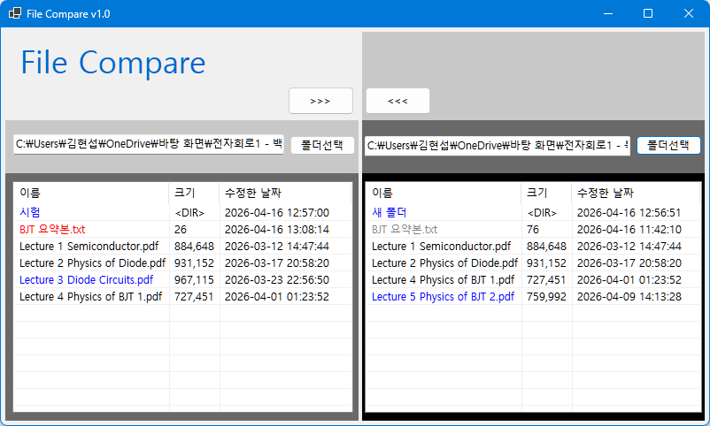
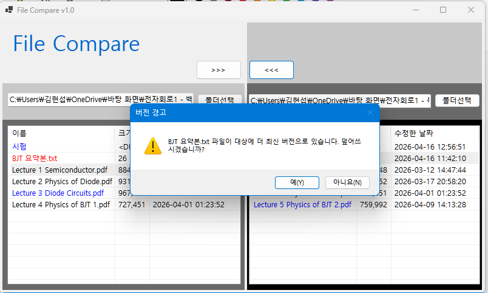
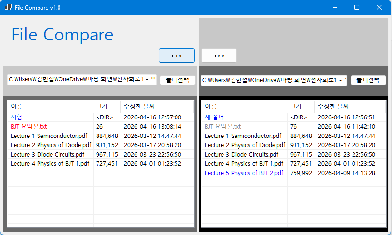
- 구현한 내용 (위 그림 참조)
	- 복사 버튼을 이용하여 파일을 복사하는 기능 추가
	- 버전이 다른 파일을 복사할 때 사용자에게 확인 메시지 표시
	- 구버전을 신버전으로 복사할 때 사용자에게 경고 메시지 표시

## 실행 화면 (과제4)
- 코드의 실행 스크린샷과 구현 내용 설명

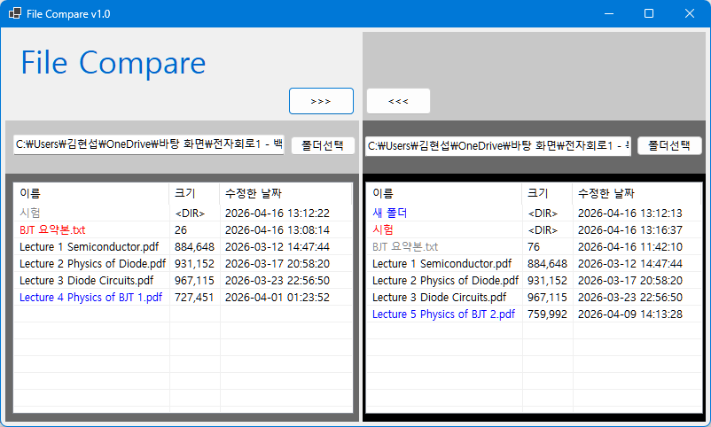
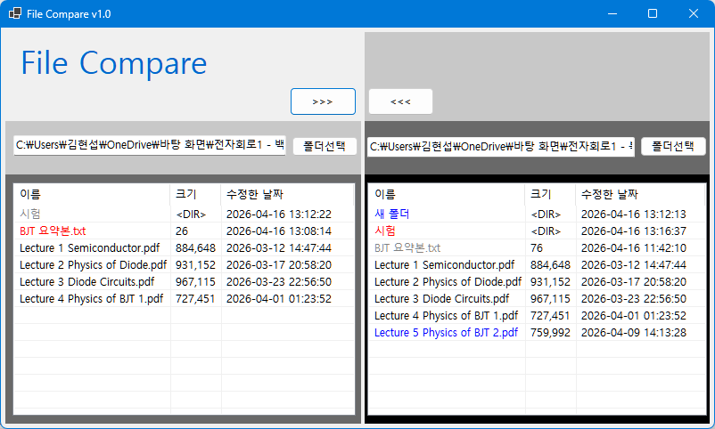
- 구현한 내용 (위 그림 참조)
	- 폴더와 하위 디렉토리의 파일을 비교하는 기능 추가
	- 복사 버튼을 이용하여 폴더와 하위 디렉토리의 파일을 복사하는 기능 추가

## 배운 점
- C# 윈도우 폼 애플리케이션 개발 경험
- 비교 알고리즘 구현 및 파일 시스템 접근 방법 학습
- 사용자 인터페이스 디자인과 이벤트 처리에 대한 이해 향상
- UX 고려한 기능 구현 (예: 사용자 확인 메시지, 경고 메시지 등)